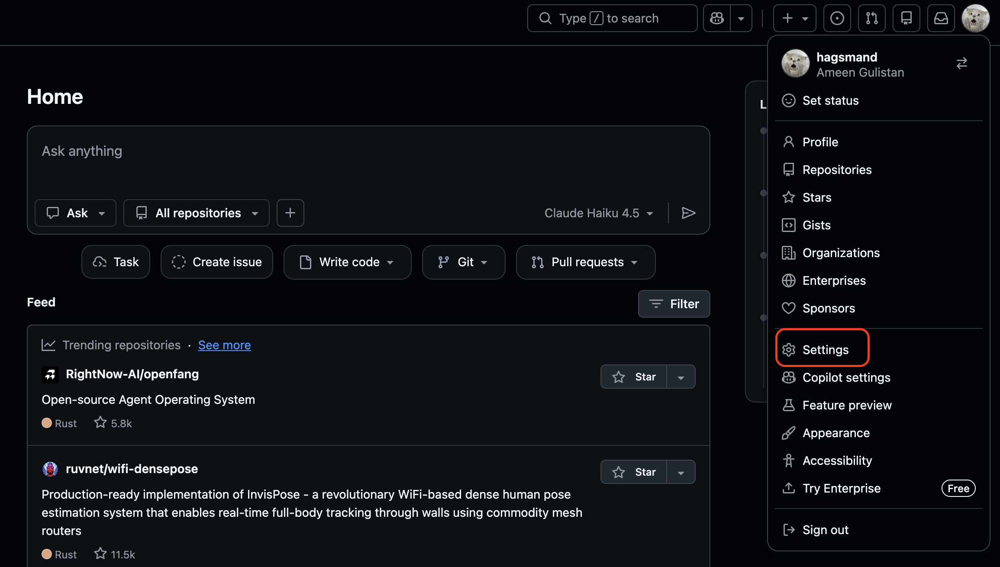
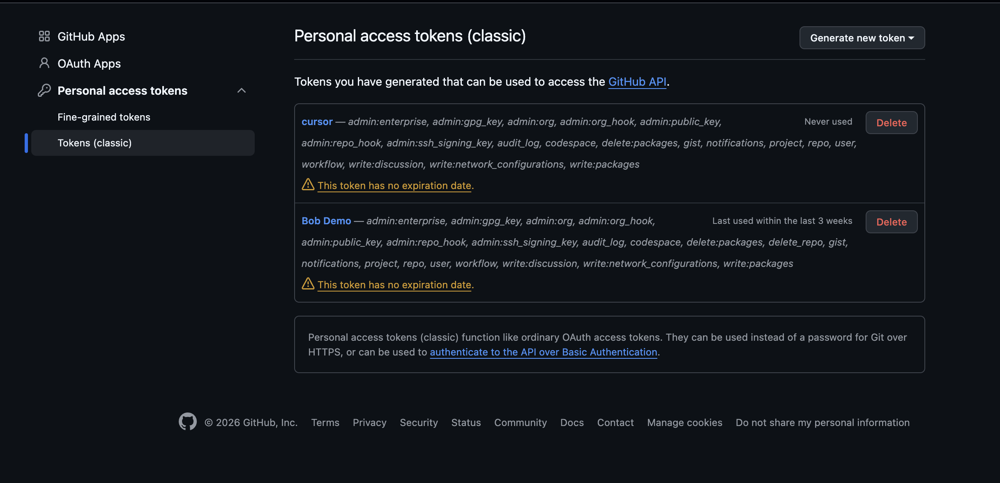
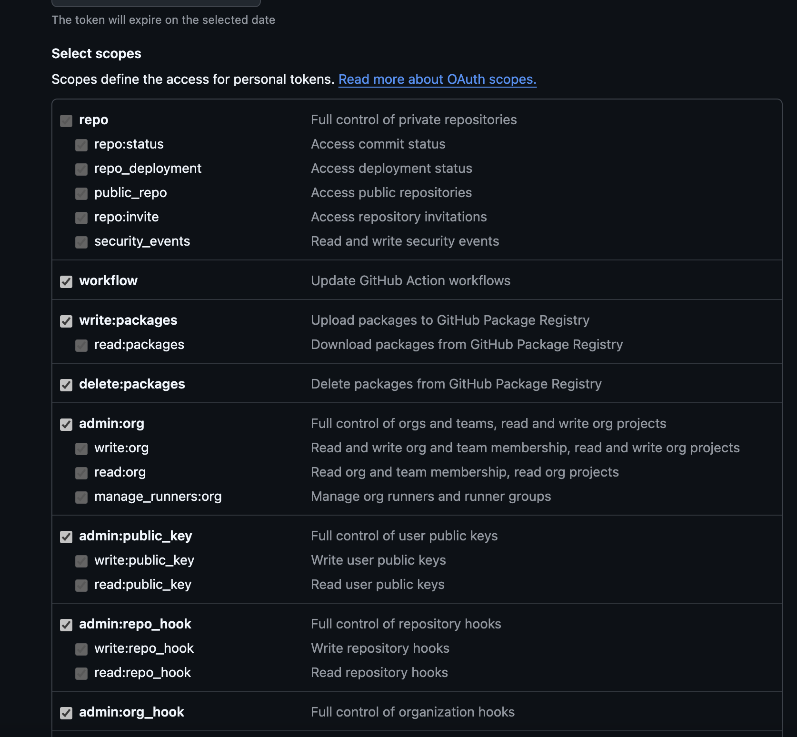
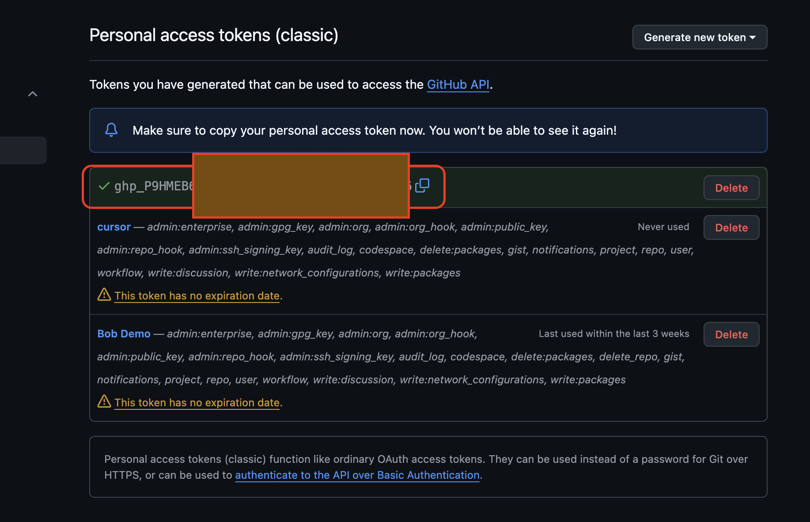
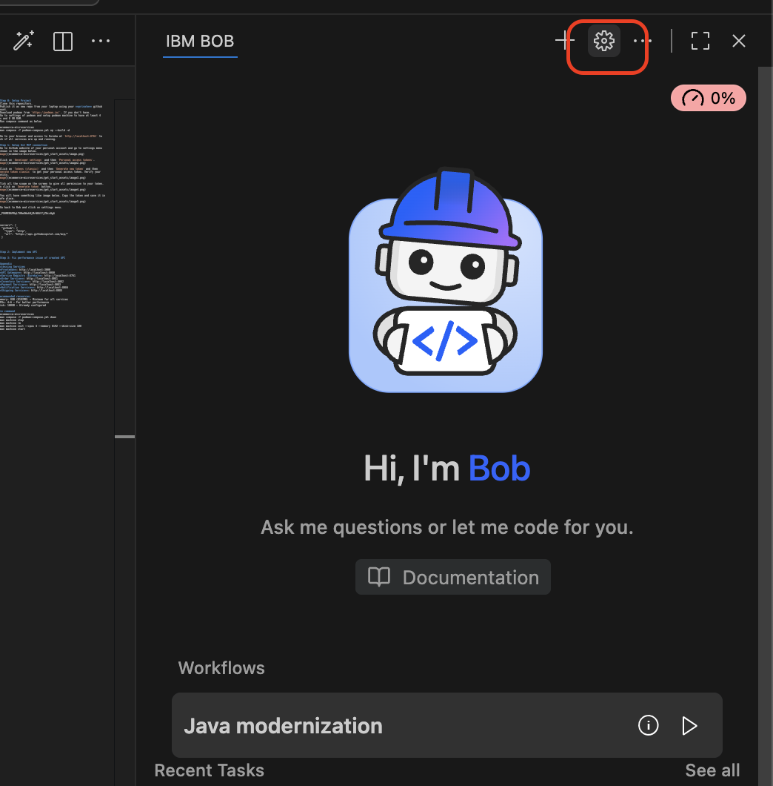
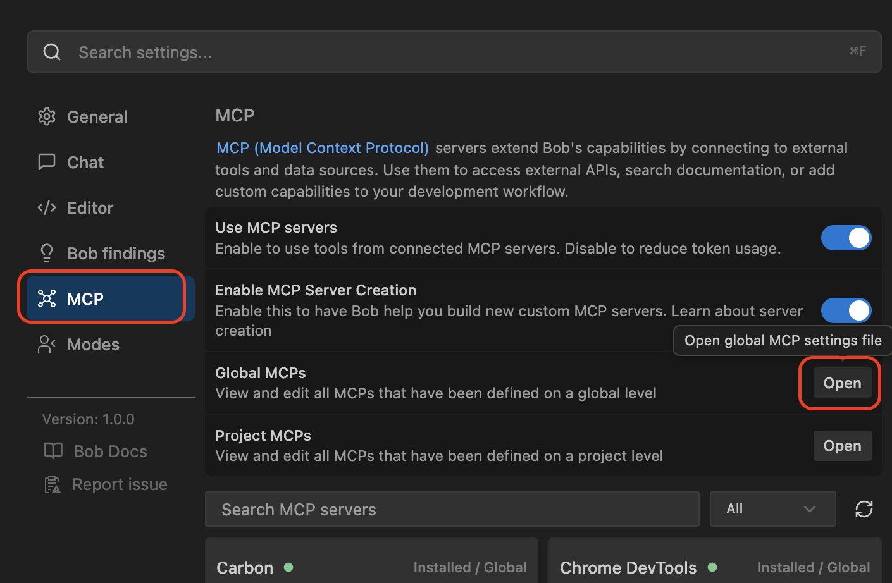
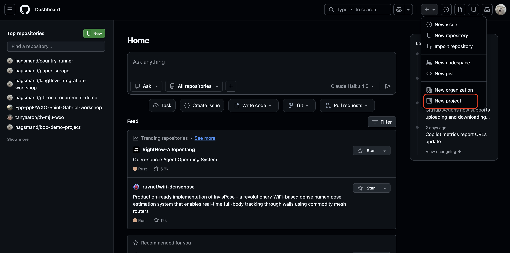
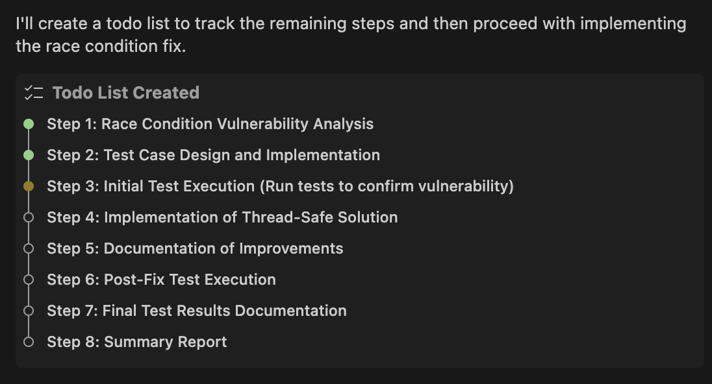

## Setup Bob
1. Go to https://bob.ibm.com/
2. Click 'Download' and click 'Download for macOS/Windows'
3. Install the downloaded program.
4. Go back to https://bob.ibm.com/ and click 'Get free trial'
5. Complete registration. You may use Google account if you have.
6. Go back to Bob application. Click 'Sign in' on the chat box.
7. The program should redirect you to browser to login.


## Step 0: Setup Project
1. Fork this repository using your **private** github account. Ensure it's on your account after forked. **Important: tick out copy only master branch**
2. Clone your forked project to your laptop.
3. Download podman from `https://podman.io/`. If you don't have.
4. Go to settings of podman and setup podman machine to have at least 4 CPUs and 8 GB RAM.
5. Run compose command as below
```
cd ecommerce-microservices
podman compose -f podman-compose.yml up --build -d
```
6. Go to your browser and access to Eureka at `http://localhost:8761` to check if all services are up and running.
7. Explore the UI at `http://localhost:3000` and understand how flow works.
7.1 Try setup inventory with quantity 1
7.2 Try create order that comsume all the created product 
7.3 Try tracking saga flow of this order
7.4 Create another order on the product that you created in step 7.1. You will see that when no product left in the inventory the service will throw 500 which in not our expected result.

## Step 1: Setup Git MCP connection
1. Go to Github website of your personal account and go to settings menu as shown in the image below.


2. Click on `Developer settings` and then `Personal access tokens`.


3. Click on `Tokens (classic)` and then `Generate new token` and then `Generate token classic` to get your personal access token. Verify your identity.


4. Tick all the scope on the screen to give all permission to your token. Then click on `Generate token` button.


5. You will have something like image below. Copy the token and save it in a safe place.


6. Go back to Bob and click on settings menu. Go on MCP menu. Then click on `Open` of Global settings.



7. Paste the snippet below by replacing your Github token first. Then save the json MCP file that you edited. 

```
"github": {
      "command": "podman",
      "args": [
        "run",
        "-i",
        "--rm",
        "-e",
        "GITHUB_PERSONAL_ACCESS_TOKEN",
        "-e",
        "GITHUB_TOOLSETS",
        "-e",
        "GITHUB_READ_ONLY",
        "-e",
        "GITHUB_HOST",
        "ghcr.io/github/github-mcp-server"
      ],
      "env": {
        "GITHUB_PERSONAL_ACCESS_TOKEN": "<your personal access token>",
        "GITHUB_TOOLSETS": "",
        "GITHUB_READ_ONLY": "",
        "GITHUB_HOST": "https://github.com"
      }
    }
```
8. Select Bob's Advanced Mode and ask "do you have access to github mcp?".

## Step 1: Setup project
1. Go to Github menu and click create project as shown in image below.


2. Click green button `New Project`
3. Select `Kanban` template.
4. Tick `Import items from repository` and select repository you created in step 0.
5. If you see the Kanban board, you are good to go for this step.

## Step 2 (Part 1): Update API Service

### 2.1 Create the GitHub Issue

#### 2.1. Create an issue in Github Backlog by clicking `+ Add Item` button.
#### 2.2. Type `Graceful out-of-stock handling in Saga Tracking UI` and click `Create new issue` then click `Blank issue`.
#### 2.3. Copy content from path `get_start_assets/lab1_graceful_handling/issue.md` into the issue page, click create issue, and assign to yourself.
#### 2.4. If you have an issue with permission to create issue go to 'project setting' and tick on 'Issues' under Features section.

### 2.2 Ask Bob to Fix the Issue

Send the following message to Bob:

```
There is a new GitHub issues assigned to me on the backlong. Pull that issue name "Graceful out-of-stock handling in Saga Tracking UI", understand it, and make changes to the code according to the criteria and information in the issue. Access the issue using the existing GitHub MCP.
```

Try restart all services with command:

```
podman compose -f podman-compose.yml down -v
podman machine stop
podman machine start
podman compose -f podman-compose.yml up --build -d
```

### 2.3 Update the Documentation

After Bob applies the fix, send this follow-up message:

```
Please also update the README and other related documentation and visualization according to the change you just made.
```

### 2.4 Add the unit test
### Use the example prompt and input to Bob:
```
I need to write a unit test for the OrderServiceImpl class in a Spring Boot microservice.

CONTEXT:
- Service: OrderServiceImpl
- Method: createOrder(OrderRequest orderRequest)
- Dependencies: OrderRepository (mocked), KafkaTemplate (mocked)
- Testing Framework: JUnit 5, Mockito
- Pattern: Given-When-Then

BUSINESS SCENARIO:
Given a customer with ID "550e8400-e29b-41d4-a716-446655440000" wants to order 2 units of "Laptop" (product ID: "660e8400-e29b-41d4-a716-446655440000") at $1000 per unit
When the createOrder method is called
Then:
- The order should be saved to the repository
- The total amount should be calculated as $2000
- The initial status should be PENDING
- The status should be updated to INVENTORY_CHECKING
- An OrderCreatedEvent should be published to Kafka topic "order-events"
- The saved order should be returned as OrderResponse

REQUIREMENTS:
1. Use @ExtendWith(MockitoExtension.class)
2. Mock OrderRepository and KafkaTemplate
3. Use @InjectMocks for OrderServiceImpl
4. Test method name: shouldCreateOrderWithCorrectTotalAndPublishEventWhenValidRequestProvided
5. Verify:
   - repository.save() called twice (initial save and status update)
   - kafkaTemplate.send() called once with correct topic and event
   - Total amount calculation is correct
   - Status transitions are correct
6. DO NOT create a fake test - use actual business logic
7. Include assertions for all critical behaviors

CODE CONTEXT:
See order-service/src/main/java/com/hacisimsek/order/service/impl/OrderServiceImpl.java
Lines 31-86 contain the createOrder method implementation

Generate a complete, runnable test method.
```
### Verify by sending this prompt to Bob:
`Run @/podman-compose.test.yml`

## Step 3: Security Vulnerability Detection and Fix

### 3.1 Bob Findings
followthese steps to utilise bob findings:
1. switch branch to `security` using the following command
```
git checkout security
```
or go to the github browser and click on `branch in the menu, choose `security` and download zip file

2. Open the **Bob Findings** panel in your IDE

3. Select a security finding from the Bob Findings panel
2. Click on the **Quick Fix** option
3. Review Bob's suggested fix
4. Accept the fix to automatically remediate the vulnerability

### 3.2 Race condition imporvement for Inventory Service

send the following massage to BOB to initiate the race condition improvement for the inventory service:
```
I want to improve the race condition for the inventory service. Use the @RACE_CONDITION_ANALYSIS_AND_FIX_PLAN_COMPLETE.md as a guideline. to create test file, run the test file on container, and fix the issue.
```
BOB will then follow these 8 steps provided in the plan: 

To execute the race condition tests using the provided Podman Compose configuration:

```bash
podman-compose -f podman-compose.race-condition-test.yml up race-condition-tests
```

To clean up the test service, use the following command
```
podman-compose -f podman-compose.race-condition-test.yml down

bash scripts/cleanup-race-test-containers.sh
```


## Appendix
# Accessing Services
- **Frontend**: http://localhost:3000
- **API Gateway**: http://localhost:8080
- **Service Registry (Eureka)**: http://localhost:8761
- **Order Service**: http://localhost:8081
- **Inventory Service**: http://localhost:8082
- **Payment Service**: http://localhost:8083
- **Notification Service**: http://localhost:8084
- **Shipping Service**: http://localhost:8085

# Recommended resources:
- Memory: 8GB (8192MB) - Minimum for all services
- CPUs: 4-6 - For better performance
- Disk: 100GB - Already configured

# Fix command Podman machine
```
cd ecommerce-microservices
podman compose -f podman-compose.yml down
podman machine stop
podman machine rm
podman machine init --cpus 4 --memory 8192 --disk-size 100
podman machine start
```

# Restart specific service
```
podman compose -f podman-compose.yml up --build --force-recreate mcp-frontend -d
```

# Restart Podman compose
```
podman compose -f podman-compose.yml down -v
podman machine stop
podman machine start
podman compose -f podman-compose.yml up --build -d
```

