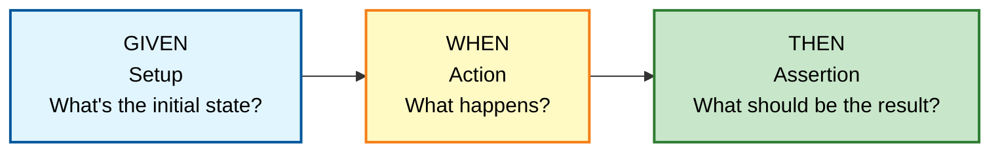
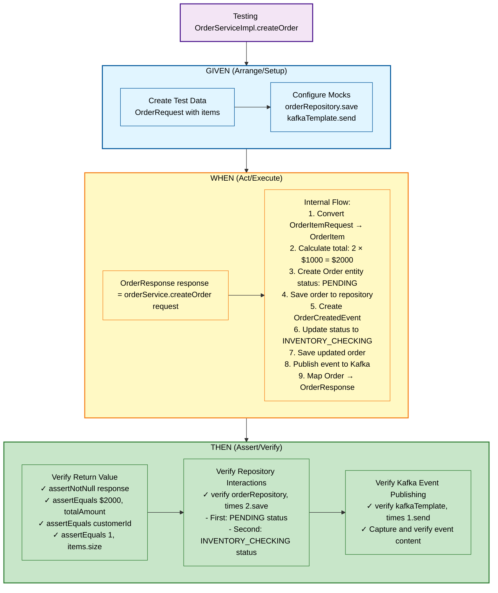
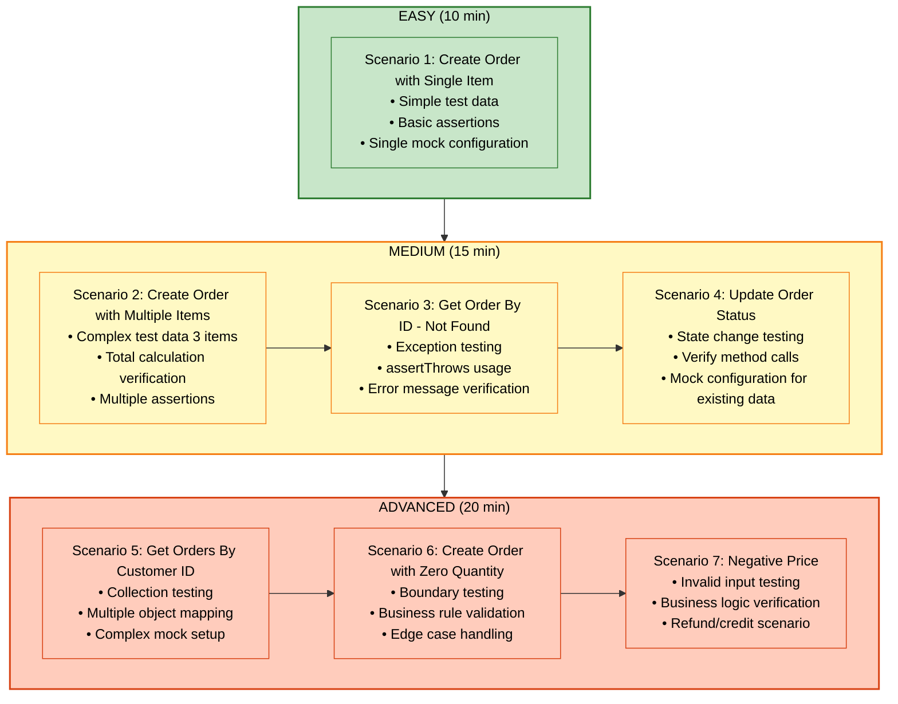
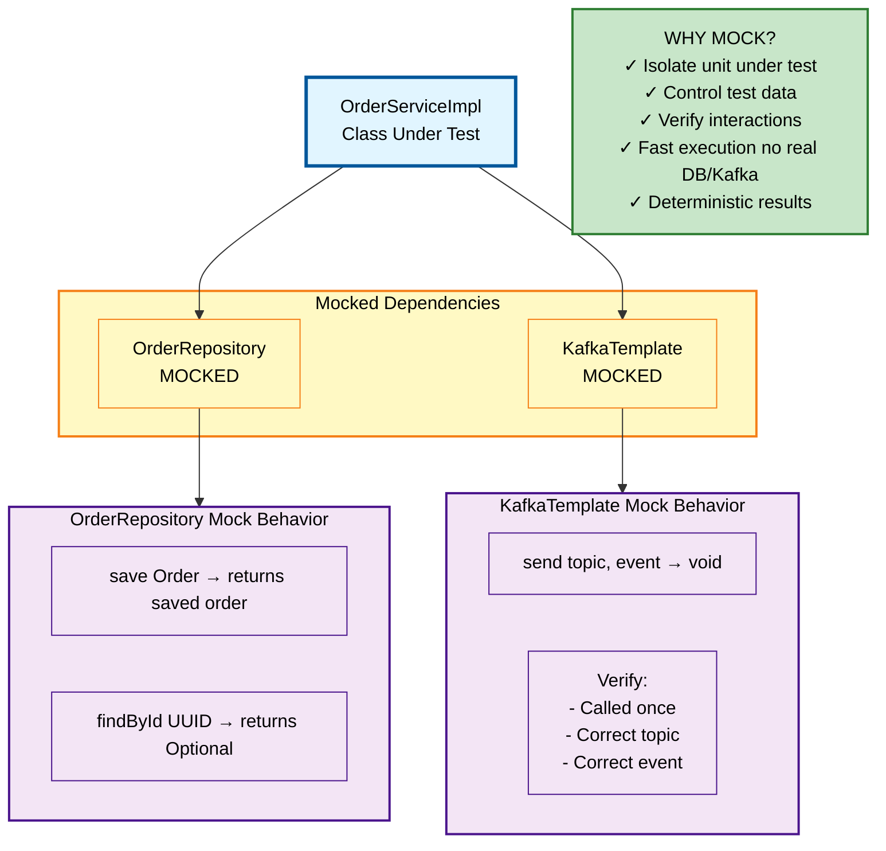
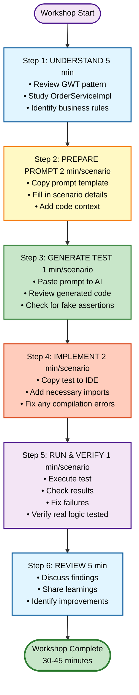
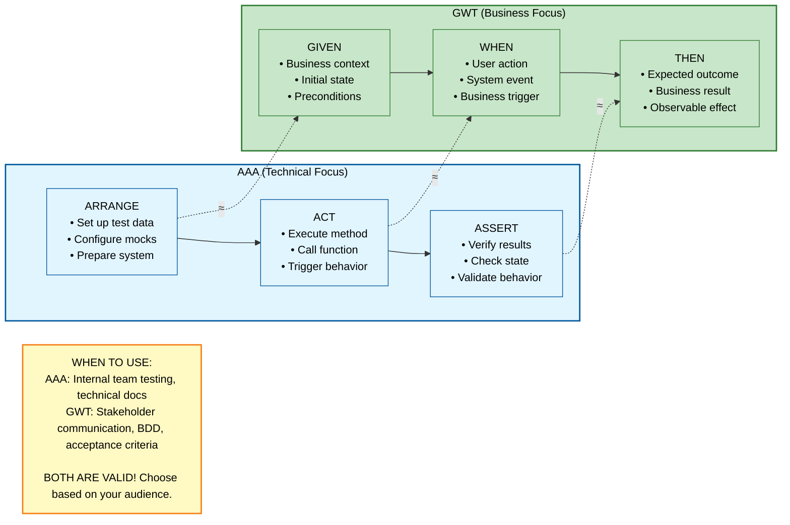
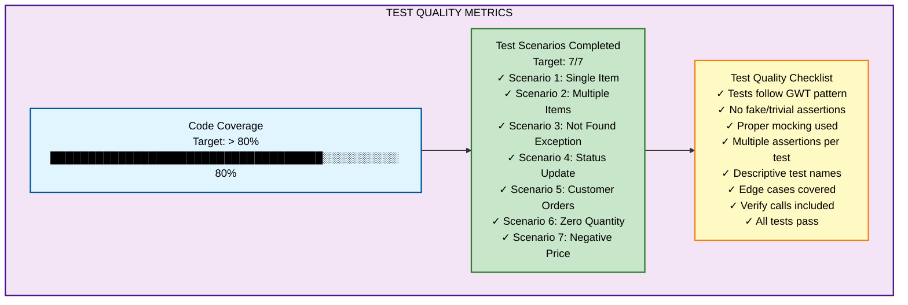

# Unit Testing Workshop - Visual Diagrams

Visual reference guide for understanding Test-Driven Development (TDD) patterns and unit testing concepts using the Order Service as a practical example.

*Workshop Focus: Order Service Unit Testing*  
*Pattern: Given-When-Then (GWT)*  
*Last Updated: 2026-04-16*

---

## Table of Contents

- [Given-When-Then Pattern Flow](#given-when-then-pattern-flow)
- [Order Service Test Flow Diagram](#order-service-test-flow-diagram)
- [Test Scenario Complexity Levels](#test-scenario-complexity-levels)
- [Mocking Strategy Diagram](#mocking-strategy-diagram)
- [Test Execution Flow](#test-execution-flow)
- [AAA vs GWT Comparison](#aaa-vs-gwt-comparison)
- [Success Metrics Dashboard](#success-metrics-dashboard)
- [Workshop Timeline](#workshop-timeline)

---

## Given-When-Then Pattern Flow

**Pattern Explanation:**
- **GIVEN**: Set up the test environment and initial conditions
- **WHEN**: Execute the action or behavior being tested
- **THEN**: Verify the expected outcomes and side effects

---

## Order Service Test Flow Diagram

**Key Testing Points:**
- Mock external dependencies (repository, Kafka)
- Verify business logic (price calculation, status transitions)
- Confirm side effects (database saves, event publishing)

---

## Test Scenario Complexity Levels

**Progressive Learning Path:**
- Start with simple scenarios to build confidence
- Progress to medium complexity for real-world patterns
- Challenge with advanced scenarios for edge cases

---

## Mocking Strategy Diagram

**Mocking Best Practices:**
- Mock external dependencies only (databases, message queues, external APIs)
- Keep business logic in the real implementation
- Verify both return values and side effects
- Use argument captors for complex verification

---

## Test Execution Flow

**Workshop Workflow:**
1. **Understand** - Learn the concepts and codebase
2. **Prepare** - Craft effective AI prompts
3. **Generate** - Use AI to create test code
4. **Implement** - Integrate tests into project
5. **Verify** - Run and validate tests
6. **Review** - Reflect and improve

---

## AAA vs GWT Comparison

**Pattern Selection Guide:**
- **AAA (Arrange-Act-Assert)**: Technical teams, unit tests, implementation details
- **GWT (Given-When-Then)**: Business stakeholders, BDD, user stories, acceptance criteria
- Both patterns are equivalent in structure, differing mainly in terminology and audience

---

## Success Metrics Dashboard

**Quality Indicators:**
- **Coverage**: Aim for >80% line coverage
- **Scenarios**: Complete all 7 test scenarios
- **Quality**: Follow best practices checklist

---

## Workshop Timeline

```mermaid
gantt
    title Workshop Timeline (30-45 minutes)
    dateFormat mm
    axisFormat %M min
    
    section Setup
    Understand Concepts           :00, 5m
    
    section Easy
    Scenario 1 Single Item        :05, 5m
    
    section Medium
    Scenario 2 Multiple Items     :10, 5m
    Scenario 3 Not Found          :15, 5m
    Scenario 4 Status Update      :20, 5m
    
    section Advanced
    Scenario 5 Customer Orders    :25, 7m
    Scenario 6 Zero Quantity      :32, 5m
    Scenario 7 Negative Price     :37, 5m
    
    section Wrap-up
    Review & Discussion           :42, 5m
```

**Time Management:**
- **Setup (5 min)**: Understand concepts and codebase
- **Easy (5 min)**: Build confidence with simple scenario
- **Medium (15 min)**: Practice with realistic scenarios
- **Advanced (17 min)**: Challenge with edge cases
- **Wrap-up (5 min)**: Review and discuss learnings

---

## Usage Notes

**For Workshop Facilitators:**
- Use these diagrams during presentation to explain concepts visually
- Reference specific diagrams when introducing each workshop phase
- Display the timeline to keep participants on track

**For Participants:**
- Refer to these diagrams when writing tests
- Use the GWT pattern flow as a mental model
- Check the success metrics to validate your work

**Technical Notes:**
- All diagrams use Mermaid syntax and render automatically on GitHub
- Text is styled in black for optimal readability
- Color coding indicates different phases and complexity levels

---

*Created for: PCC Workshop - Microservices Unit Testing*  
*Service Focus: Order Service (OrderServiceImpl)*  
*Last Updated: 2026-04-16 14:31:00 +0700*